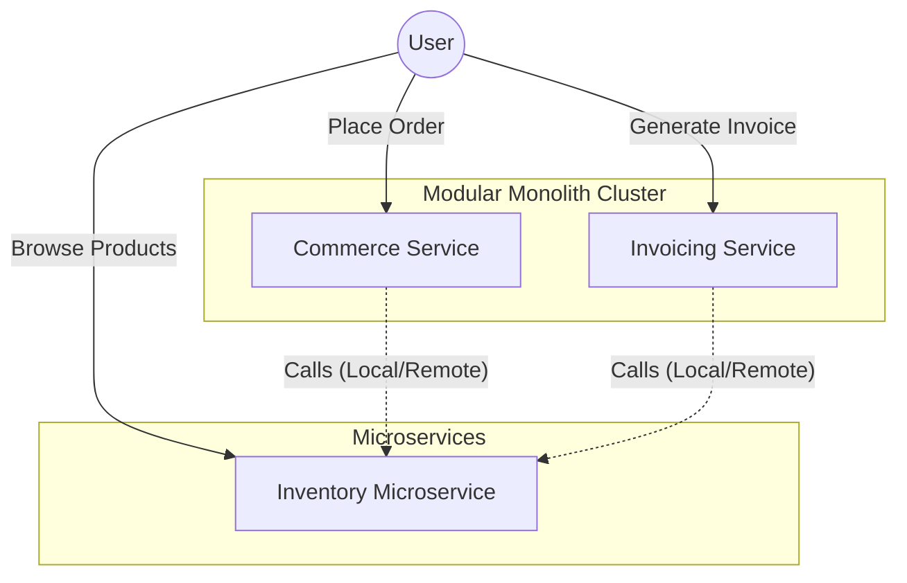
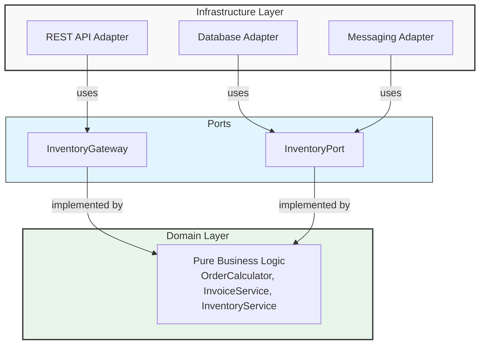
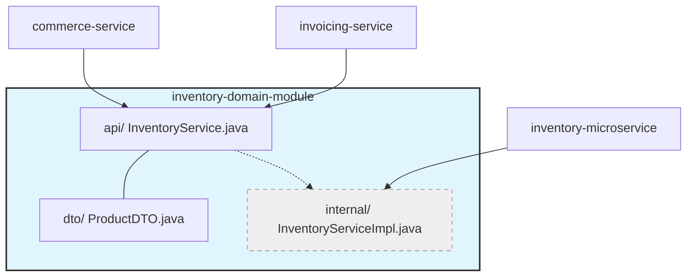
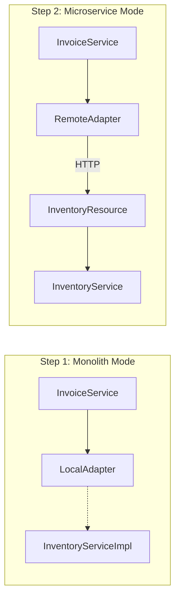

# Quarkus Modular Monolith


> **A production-ready reference architecture for Modular Monoliths using Quarkus** that evolve into Microservices without costly rewrites.

---

## Why this architecture?

| Problem | Solution |
|---------|----------|
| **Microservices too early** → complexity without benefits | Start with a **modular monolith**, evolve when needed |
| **Monolith too coupled** → painful refactoring | **Hexagonal architecture** with enforced boundaries |
| **Version conflicts** → dependency hell | **Centralized BOM** as single source of truth |
| **Code duplication** → maintenance burden | **Shared domain modules** across services |
| **Architecture decay** → silent violations | **ArchUnit tests** validate isolation in CI/CD |

---

## Architecture overview



This project implements a **Modular Monolith** using **Hexagonal Architecture (Ports & Adapters)**. Ideally suited for teams that want to start fast but keep the option to scale to microservices later.

### 1. Hexagonal architecture (Ports & Adapters)

The core architectural pattern used is **Hexagonal Architecture** (also known as Ports and Adapters). This ensures that the domain logic remains pure and independent of frameworks, databases, and external interfaces.



**Key principle**: Domain remains **pure** - no JPA annotations, no REST dependencies, no framework code.

### 2. Centralized Bill of Materials (BOM) & version management

Managing dependencies in a distributed modular system can be complex. We solve this using a multi-level BOM strategy to ensure consistency across the entire ecosystem.

#### The `platform-bom`

The `platform-bom` is the single source of truth for all versions. It acts as a "governance center" for the project.

```xml
<!-- All services inherit from platform-bom as parent -->
<parent>
    <groupId>org.acme</groupId>
    <artifactId>platform-bom</artifactId>
    <version>2026.02.0</version>
    <relativePath/>
</parent>
```

**What it controls:**
1.  **Framework versions**: Ensures all services use the exact same Quarkus version (e.g., `3.31.2`).
2.  **Internal module versions**: Defines the version of shared modules like `inventory-domain-module`. If `commerce-service` and `invoicing-service` both use `inventory-domain-module`, the BOM guarantees they use the *same* version.
3.  **Test libraries**: Unifies versions of JUnit, Mockito, ArchUnit, etc.
4.  **Plugin Management**: Centralizes Maven plugin versions (compiler, surefire, jandex, quarkus).

**Benefits**:
*   ✅ **Full inheritance**: Services inherit properties, dependencyManagement, and pluginManagement.
*   ✅ **Simplified updates**: Upgrade Quarkus or a shared library in one place (`platform-bom`), and all services inherit the upgrade.
*   ✅ **Conflict resolution**: Eliminates "dependency hell" by acting as the arbiter for transitive dependencies.

### 3. Shared domain modules

We share domain modules to avoid code duplication while maintaining strict boundaries.



**Benefits**:
*   ✅ Zero code duplication
*   ✅ Single implementation, multiple consumers
*   ✅ Internal packages hidden via Factory pattern

### 4. Architecture tests (ArchUnit)

We use **ArchUnit** to enforce architectural rules automatically in the CI/CD pipeline.

```java
// Enforced in CI/CD - prevents architecture decay
@Test
void domain_not_depend_on_infrastructure() {
    ModularArchitectureRules.DOMAIN_NOT_DEPEND_ON_INFRASTRUCTURE
        .check(importedClasses);
}
```

**Rules enforced**:
| Rule | Description |
|------|-------------|
| `DOMAIN_NOT_DEPEND_ON_INFRASTRUCTURE` | Domain can't import JPA, REST, etc. |
| `DOMAIN_NOT_DEPEND_ON_FRAMEWORKS` | Domain can't import Spring, Quarkus |
| `INTERNAL_PACKAGES_NOT_EXPOSED` | Only factories can access `..internal..` |
| `NO_CYCLES_BETWEEN_PACKAGES` | Prevents circular dependencies |
| `ADAPTERS_MUST_IMPLEMENT_INTERFACE` | Adapters must implement Ports |

### 5. Transparent microservice extraction

One of the main goals is to allow extracting a module into a microservice with **zero domain changes**.



**Switch with one config change**:
```bash
mvn quarkus:dev -Dquarkus.profile=remote
```

### 6. Built-in resilience

The architecture supports resilience patterns like retries and fallbacks, especially when communicating with remote services.

```java
@Retry(maxRetries = 3, delay = 200, retryOn = RuntimeException.class)
@Timeout(value = 5, unit = ChronoUnit.SECONDS)
@Fallback(fallbackMethod = "findProductsByIdsFallback")
public List<ProductInfo> findProductsByIds(List<String> productIds) {
    // HTTP call to inventory-microservice
}
```

### 7. OpenTelemetry integration

Unified observability is critical for distributed systems. We implement it across all services.

```properties
# Correlated logs with trace context
quarkus.log.console.format=%d{HH:mm:ss} %-5p traceId=%X{traceId} spanId=%X{spanId} [%c{2.}] (%t) %s%e%n
```

---

## Prerequisites

| Requirement | Version | Check command |
|-------------|---------|---------------|
| Java (JDK) | 21+ | `java -version` |
| Maven | 3.9+ | `mvn -version` |

---

## Quick start

### Build

```bash
mvn clean install
```

### Run services

```bash
# Terminal 1: Commerce Service (port 8080)
mvn quarkus:dev -pl commerce-service/infrastructure-module

# Terminal 2: Invoicing Service (port 8081)
mvn quarkus:dev -pl invoicing-service/infrastructure-module

# Terminal 3: Inventory Microservice (port 8082)
mvn quarkus:dev -pl inventory-microservice
```

### Test endpoints

```bash
# Process order
curl -X POST http://localhost:8080/api/orders \
  -H "Content-Type: application/json" \
  -d '{"customerId": "CLI-001", "items": [{"productId": "PROD-001", "quantity": 1}]}'

# Generate invoice
curl -X POST http://localhost:8081/api/invoices \
  -H "Content-Type: application/json" \
  -d '{"customerId": "CLI-001", "items": [{"productId": "PROD-001", "quantity": 2}]}'

# List products
curl http://localhost:8082/api/inventory/products
```

---

## Project structure

```
quarkus-modular-monolith/
├── platform-bom/                       # Bill of Materials (Centralized Versions)
├── architecture-rules/                 # ArchUnit rules library
│
├── commerce-service/                   # Modular Monolith 1 (port 8080)
│   ├── domain-modules/
│   │   ├── order-domain-module/   
│   │   └── inventory-domain-module/    ◄── SHARED DOMAIN MODULE
│   ├── data-shared-modules/            ◄── SHARED INFRASTRUCTURE MODULES
│   │   └── inventory-infrastructure-module/
│   ├── application-module/         
│   └── infrastructure-module/      
│
├── invoicing-service/                  # Modular Monolith 2 (port 8081)
│   ├── domain-modules/
│   │   └── invoicing-domain-module/
│   ├── application-module/         
│   └── infrastructure-module/      
│
└── inventory-microservice/             # Extracted microservice (port 8082)
```

---

## Architecture tests

```bash
mvn test -Dtest=ArchitectureTest \
  -pl commerce-service/infrastructure-module,invoicing-service/infrastructure-module,inventory-microservice
```

---

## License

MIT License
